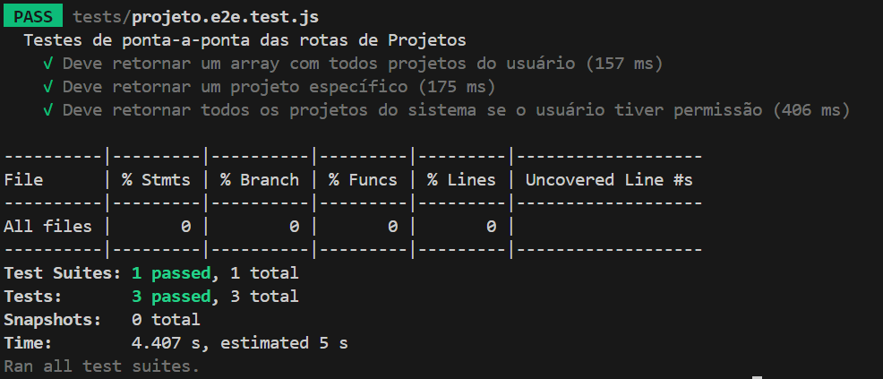

# Precise Path - Casos de Teste

> Este documento detalha casos de testes para a API Precise Path, descrevendo seu objetivo, pré-condições, procedimentos de teste, resultados esperados, obtidos e pós-condições. Estes casos de testes são automatizados usando Jest, uma popular ferramenta de testes para JavaScript.

## Caso de Teste: Consulta de todos os projetos do usuário

### Objetivo

Verificar se a API retorna corretamente um array contendo todos os projetos associados a um usuário autenticado, assegurando que cada projeto no array corresponda ao schema esperado.

### Pré-condição

- O usuário com o email `victorteste@gmail.com` e senha `123456` deve existir no sistema.
- O usuário deve ter pelo menos um projeto associado à sua conta.
- A API deve estar rodando no endereço `http://localhost:3000`.

### Procedimento de Teste

1. **Autenticação do usuário**: Enviar uma requisição POST para `http://localhost:3000/auth` com o email e senha do usuário para obter um token de autenticação.
2. **Consulta de projetos**: Enviar uma requisição GET para `http://localhost:3000/projetos`, incluindo o token de autenticação no cabeçalho `Authorization`.
3. **Validação dos dados recebidos**: Verificar se a resposta é um array de objetos e se cada objeto no array corresponde ao schema definido para um projeto.
4. **Validação do schema**: Utilizar a biblioteca Joi para validar cada projeto retornado contra o schema esperado.

### Resultado Esperado

- A resposta à consulta de projetos deve ser um array de objetos.
- Cada objeto no array deve corresponder ao schema definido, sem erros de validação.
- O status code da resposta deve ser 200 (OK).

### Resultado Obtido

- A resposta à consulta de projetos foi um array de objetos.
- Cada objeto no array correspondeu ao schema definido, sem erros de validação.
- O status code da resposta foi 200 (OK).

> Obs.: Ao final deste documento, há o retorno do teste automatizado, que confirma os resultados obtidos.

### Pós-condição

- Não há alterações no estado do sistema ou dos dados.
- O token de autenticação continua válido até sua expiração.

---

## Caso de Teste: Consulta de um projeto específico

### Objetivo

Verificar se a API retorna corretamente um objeto contendo os detalhes de um projeto específico, assegurando que o objeto corresponda ao schema esperado.

### Pré-condição

- O usuário com o email `victorteste@gmail.com` e senha `123456` deve existir no sistema.
- O usuário deve ter pelo menos um projeto associado à sua conta.
- O projeto com o ID `1` deve existir no sistema.
- A API deve estar rodando no endereço `http://localhost:3000`.

### Procedimento de Teste

1. **Autenticação do usuário**: Enviar uma requisição POST para `http://localhost:3000/auth` com o email e senha do usuário para obter um token de autenticação.
2. **Consulta de projeto específico**: Enviar uma requisição GET para `http://localhost:3000/projetos/1`, incluindo o token de autenticação no cabeçalho `Authorization`.
3. **Validação dos dados recebidos**: Verificar se a resposta é um objeto e se o objeto corresponde ao schema definido para um projeto.
4. **Validação do schema**: Utilizar a biblioteca Joi para validar o projeto retornado contra o schema esperado.

### Resultado Esperado

- A resposta à consulta do projeto deve ser um objeto.
- O objeto deve corresponder ao schema definido, sem erros de validação.
- O status code da resposta deve ser 200 (OK).

### Resultado Obtido

- A resposta à consulta do projeto foi um objeto.
- O objeto correspondeu ao schema definido, sem erros de validação.
- O status code da resposta foi 200 (OK).

> Obs.: Ao final deste documento, há o retorno do teste automatizado, que confirma os resultados obtidos.

### Pós-condição

- Não há alterações no estado do sistema ou dos dados.
- O token de autenticação continua válido até sua expiração.

---

## Caso de Teste: Consulta de todos os projetos para um usuário ADMIN

### Objetivo

Verificar se a API retorna corretamente um array contendo todos os projetos associados a um usuário ADMIN autenticado, assegurando que cada projeto no array corresponda ao schema esperado. Se o usuário não for ADMIN, a API deve retornar um erro de permissão com status code 403.

### Pré-condição

- O usuário com o email `victorteste@gmail.com` e senha `123456` deve existir no sistema.
- O usuário deve ter pelo menos um projeto associado à sua conta.
- O usuário deve ser um administrador (ter permissão ADMIN).
- A API deve estar rodando no endereço `http://localhost:3000`.

### Procedimento de Teste

1. **Autenticação do usuário**: Enviar uma requisição POST para `http://localhost:3000/auth` com o email e senha do usuário para obter um token de autenticação.
2. **Consulta de projetos**: Enviar uma requisição GET para `http://localhost:3000/projetos/all`, incluindo o token de autenticação no cabeçalho `Authorization`.
3. **Validação dos dados recebidos**: Verificar se a resposta é um array de objetos e se cada objeto no array corresponde ao schema definido para um projeto.
4. **Validação do schema**: Utilizar a biblioteca Joi para validar cada projeto retornado contra o schema esperado.

### Resultado Esperado

- A resposta à consulta de projetos deve ser um array de objetos.
- Cada objeto no array deve corresponder ao schema definido, sem erros de validação.
- O status code da resposta deve ser 200 (OK).
- Se o usuário não for ADMIN, a API deve retornar um erro de permissão com status code 403.

### Resultado Obtido

- A resposta à consulta de projetos foi um array de objetos.
- Cada objeto no array correspondeu ao schema definido, sem erros de validação.
- O status code da resposta foi 200 (OK).

> Obs.: Ao final deste documento, há o retorno do teste automatizado, que confirma os resultados obtidos.

### Pós-condição

- Não há alterações no estado do sistema ou dos dados.
- O token de autenticação continua válido até sua expiração.

---

## Resultados dos Testes Automatizados

Abaixo estão os resultados dos testes automatizados para os casos de teste descritos acima. Os testes foram executados usando a ferramenta Jest, que é uma popular ferramenta de testes para JavaScript.

